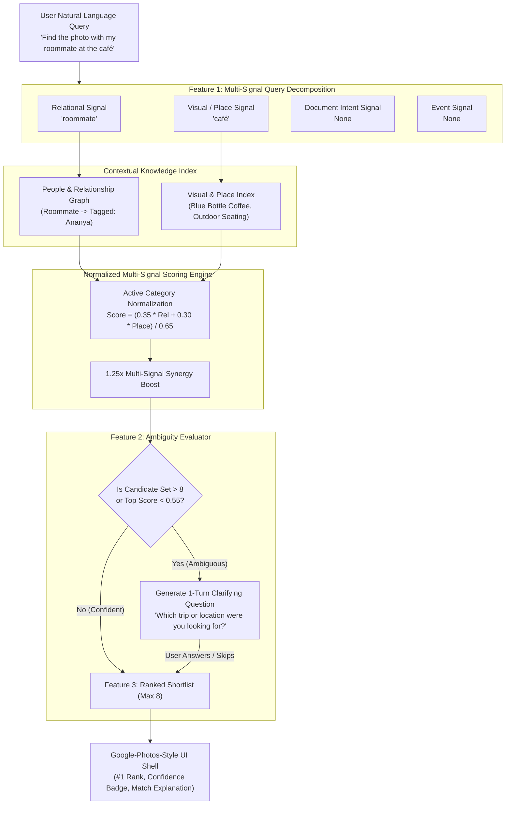

# MemoryLens — AI-Native Vague-Memory Retrieval Assistant
## Comprehensive Feature & Architecture Specification

---

### Executive Summary

**MemoryLens** is an AI-native photo retrieval prototype designed to solve the **Stage 2 (System Understanding)** root cause in photo search. Standard photo search systems rely on rigid keyword matching against static tags. When users query their memory using natural, vague, relational, or contextual language (e.g., *"the photo with my roommate at the café"* or *"the receipt I screenshotted for my laptop"*), traditional keyword systems fail.

MemoryLens solves this by introducing **Multi-Signal Query Decomposition**, breaking down human natural-language memories into distinct structured signals (People/Relationship, Visual/Place, Document Intent, Event, Temporal) and matching them against a contextual multi-signal knowledge index.

---



---

## Core Features Breakdown

### 1. Multi-Signal Query Decomposition (Feature 1)

Traditional search engines attempt to match a query string verbatim against photo tags. Multi-Signal Query Decomposition instead translates unstructured human memory into five structured signal categories:

| Signal Category | Example Query Triggers | Searched Dataset Fields | Description & Matching Logic |
|---|---|---|---|
| **Relational Terms** | `"roommate"`, `"sister"`, `"cousin"`, `"college friend"` | `relationships[]`, `tagged_names[]` | Maps relational roles to tagged individuals via the People Graph. |
| **Document Intent** | `"receipt for laptop"`, `"flight ticket"`, `"concert pass"` | `document_purpose`, `ocr_text` | Detects intent to locate invoices or passes rather than physical object photos. |
| **Visual & Place** | `"birthday cake"`, `"blue chairs"`, `"café"`, `"beach"` | `place_name`, `visual_descriptors[]` | Performs semantic/fuzzy matching over visual objects and location names. |
| **Event Context** | `"baking session"`, `"graduation"`, `"game night"` | `event_tags[]` | Matches named events, activities, and social gatherings. |
| **Temporal Terms** | `"Summer 2024"`, `"Fall 2023"`, `"last summer"` | `approx_date_range`, `date_taken` | Filters photos by approximate date windows or seasonal ranges. |

#### Scoring & Synergy Multiplier Math
1. **Active Category Normalization**: Scores are calculated *only* over categories present in the user's query:
   $$\text{base\_score} = \frac{\sum_{c \in C_{\text{active}}} w_c \cdot s_c}{\sum_{c \in C_{\text{active}}} w_c}$$
   Where category weights $w_c$ are defined as: Relational (0.35), Document (0.35), Visual/Place (0.30), Event (0.25), Temporal (0.20).
2. **Multi-Signal Synergy Boost**: A $1.25\times$ multiplier is applied when a photo matches multiple independent signals (e.g., both Relational AND Visual/Place), ensuring multi-signal target photos outrank single-keyword coincidence hits.
3. **Confidence Bands**:
   * $\text{Score} \ge 0.70 \rightarrow \mathbf{\text{High Match}}$ (Teal/Green Badge)
   * $0.30 \le \text{Score} < 0.70 \rightarrow \mathbf{\text{Medium Match}}$ (Blue/Amber Badge)
   * $\text{Score} < 0.30 \rightarrow \mathbf{\text{Filtered Out}}$ (Triggers zero-match empty state if all photos fail)

---

### 2. Ambiguity Trigger & 1-Turn Clarifying Question (Feature 2)

When a query is overly broad (e.g., searching `"photo from a trip"` in a library with 11 trip photos), showing an unfiltered grid overwhelms the user. MemoryLens detects ambiguity and asks **exactly one** targeted follow-up question.

* **Ambiguity Trigger Conditions**:
  * **Condition A**: Candidate set $> 8$ photos and 8th photo score $\ge 85\%$ of top photo score.
  * **Condition B**: Candidate set $\ge 4$ photos and top photo score $< 0.55$.
* **Optimal Question Generator**: Evaluates candidate metadata to identify which dimension (Location, Person, or Date) offers the highest information gain.
* **Interactive Card UI**: Displays an inline question card with selectable option chips and a visible **Skip** button.
* **Strict 1-Turn Limit Constraint**: Hardcoded safety constraint preventing the system from ever looping into a second question. Answering or skipping immediately yields the refined shortlist.

---

### 3. Ranked Shortlist with "Why This Matched" Explanations (Feature 3)

To fix the evaluation-cost problem ("grid overload"), MemoryLens replaces infinite photo grids with a curated, transparent shortlist:

* **Strict Max-8 Cap**: Never renders more than 8 results, keeping visual fatigue to a minimum.
* **Visual Rank Badges**: Each card displays its rank (`#1`, `#2`, etc.) and confidence band (`High Match` / `Medium Match`).
* **Transparent Explanations**: Pulls directly from matched signals to explain *why* the image was retrieved (e.g., `"Matches relational 'roommate' + visual descriptor 'Blue Bottle Coffee'"` or `"Matches document purpose 'laptop purchase receipt'"`).

---

### 4. Search Mode Toggle (AI Decomposed vs. Literal Baseline)

A live header toggle switch allowing users and evaluators to compare **AI Decomposed Search** against traditional **Literal Keyword Search** side-by-side:

* **AI Decomposed Mode**: Runs full signal decomposition, people graph resolution, and multi-signal scoring.
* **Literal Baseline Mode**: Performs literal substring search over standard text fields (`place_name`, `ocr_text`, `visual_descriptors`, `event_tags`). Demonstrates how traditional keyword search fails on vague or relational queries.

---

### 5. Google-Photos-Style UI & Lightbox Modal

* **Date-Grouped Library Grid**: Responsive desktop/mobile layout displaying the full photo collection organized chronologically by date.
* **Full-Screen Lightbox Modal**: Clicking any photo opens a detail inspector displaying:
  * High-resolution image preview.
  * Date taken & approximate date range.
  * Tagged people & relationship designations.
  * Location name & visual descriptors.
  * Event tags, document purpose, and full OCR extracted text.

---

## Data Model & Schema Specification

Each photo in the dataset is modeled with rich multi-dimensional metadata:

```json
{
  "photo_id": "photo_001",
  "image_url": "data:image/svg+xml;utf8,...",
  "date_taken": "2024-07-15T14:30:00Z",
  "approx_date_range": "Summer 2024",
  "relationships": ["roommate"],
  "tagged_names": ["Ananya"],
  "place_name": "Blue Bottle Coffee",
  "visual_descriptors": ["outdoor seating", "blue chairs", "coffee cups", "smiling women"],
  "event_tags": ["coffee hangout", "weekend"],
  "ocr_text": null,
  "document_purpose": null
}
```

---

## Acceptance Verification Summary

| Feature / Suite | Test Case | Target Result | Status |
|---|---|---|---|
| **Phase 2 (Decomposition)** | Query: `"the photo with my roommate at the café"` | Target `photo_001` at #1; Literal Baseline fails | **PASSED** |
| **Phase 2 (Decomposition)** | Query: `"the receipt I screenshotted for my laptop"` | Target `photo_006` at #1; Literal Baseline fails | **PASSED** |
| **Phase 3 (Shortlist UI)** | Ambiguous query shortlist cap check | Results capped strictly at max 8 items | **PASSED** |
| **Phase 4 (Clarifying Question)** | Query: `"photo from a trip"` | Triggers 1 question; refinement narrows shortlist; 1-turn max enforced | **PASSED** |
| **Phase 5 (E2E Chained)** | Full chained flow across Scenarios A, B, C | 100% end-to-end integration pass | **PASSED** |
| **Dataset Validation** | Schema & composition validation suite | 28 records, 16 relational, 8 documents, 6 distractors | **PASSED** |
