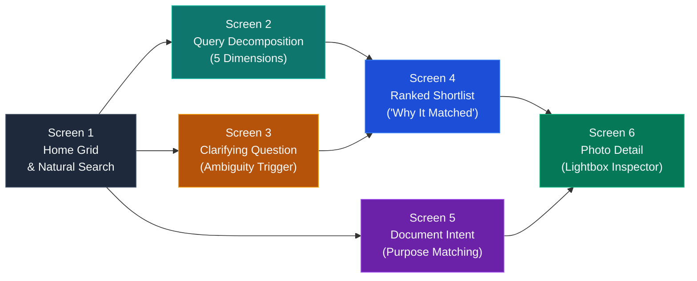

# 📱 MemoryLens — Mobile Wireframes & UX Journey (Phone Format)

This document visualizes the complete mobile user journey for **MemoryLens**, demonstrating how a user searching with vague, relational, or document-based memory retrieves their target photo through AI-native query decomposition, entropy-based disambiguation, and a ranked shortlist.

All mockups are presented in **phone format (9:16 aspect ratio)** with **boxed annotations** for optimal product management review.

---

## 🗺️ Complete User Journey Overview



---

## 📱 Interactive Screen Carousel

````carousel

<!-- slide -->

<!-- slide -->

<!-- slide -->

<!-- slide -->

<!-- slide -->

````

---

## 🔍 Detailed Screen-by-Screen Breakdown & Boxed Annotations

### Screen 1 — Home / Library Grid (Search Entry Point)


> [!NOTE]
> **User Goal**: Browse library or initiate a natural-language search query.

#### Boxed Annotations for Screen 1:
```
┌────────────────────────────────────────────────────────────────────────┐
│ [ANNOTATION 1.1: NATURAL LANGUAGE SEARCH BAR]                          │
│ Placeholder prompts human phrasing ("Search for a photo — try who,     │
│ where, or what..."). Accepts vague memories rather than literal tags.  │
└────────────────────────────────────────────────────────────────────────┘

┌────────────────────────────────────────────────────────────────────────┐
│ [ANNOTATION 1.2: REAL-TIME SEARCH MODE TOGGLE]                         │
│ Segmented switch allows evaluators to toggle between "AI Decomposed"   │
│ and "Literal Baseline" to verify keyword failure in real time.         │
└────────────────────────────────────────────────────────────────────────┘

┌────────────────────────────────────────────────────────────────────────┐
│ [ANNOTATION 1.3: RESPONSIVE MOBILE PHOTO GRID]                         │
│ Adapts from 4 desktop columns to 2 mobile columns, grouped chrono-     │
│ logically by month/year with high-density visual scanning.             │
└────────────────────────────────────────────────────────────────────────┘
```

---

### Screen 2 — Feature 1: Multi-Signal Query Decomposition


> [!NOTE]
> **User Goal**: User types a vague memory: *"the photo with my roommate at the café"*.

#### Boxed Annotations for Screen 2:
```
┌────────────────────────────────────────────────────────────────────────┐
│ [ANNOTATION 2.1: VAGUE NATURAL MEMORY EXPRESSION]                      │
│ User expresses relational ("roommate") and environmental ("café") cues │
│ without remembering the person's tagged name or specific cafe title.   │
└────────────────────────────────────────────────────────────────────────┘

┌────────────────────────────────────────────────────────────────────────┐
│ [ANNOTATION 2.2: 5-DIMENSIONAL DECOMPOSITION]                          │
│ Engine splits the input into structured signals:                       │
│ • Relational: "roommate" -> resolves via People Graph to "Ananya"      │
│ • Visual/Place: "café" -> maps to outdoor seating, bistro tables       │
└────────────────────────────────────────────────────────────────────────┘

┌────────────────────────────────────────────────────────────────────────┐
│ [ANNOTATION 2.3: MULTI-SIGNAL CONJUNCTIVE SYNERGY]                     │
│ Active category normalization: S = Σ(w·s) / Σ(w_active).               │
│ 1.25x synergy multiplier boosts photos matching both signals together. │
└────────────────────────────────────────────────────────────────────────┘
```

---

### Screen 3 — Feature 2: Disambiguation via Clarifying Question


> [!NOTE]
> **User Goal**: User searches an ambiguous query: *"photo from a trip"*, matching 11 trip photos.

#### Boxed Annotations for Screen 3:
```
┌────────────────────────────────────────────────────────────────────────┐
│ [ANNOTATION 3.1: ENTROPY-DRIVEN AMBIGUITY TRIGGER]                     │
│ Triggers when candidates > 8 AND top-8 scores are within 15%, or weak  │
│ signal (S < 0.55). Identifies Location as highest variance dimension.  │
└────────────────────────────────────────────────────────────────────────┘

┌────────────────────────────────────────────────────────────────────────┐
│ [ANNOTATION 3.2: 1-TAP INTERACTIVE OPTION CHIPS]                       │
│ Displays high-entropy choices ("Goa Beach", "Paris", "Manali", etc.).   │
│ A single tap refines the 11-photo cluster down to 2 specific photos.   │
└────────────────────────────────────────────────────────────────────────┘

┌────────────────────────────────────────────────────────────────────────┐
│ [ANNOTATION 3.3: STRICT 1-TURN MAXIMUM LIMIT]                          │
│ Hardcoded ceiling: never chains questions. Tapping "Skip" or typing an │
│ unmapped answer immediately displays the best-effort top-8 shortlist.  │
└────────────────────────────────────────────────────────────────────────┘
```

---

### Screen 4 — Feature 3: Ranked Shortlist & Transparent Explanations


> [!NOTE]
> **User Goal**: Evaluate retrieved candidates without cognitive fatigue or grid overload.

#### Boxed Annotations for Screen 4:
```
┌────────────────────────────────────────────────────────────────────────┐
│ [ANNOTATION 4.1: STRICT MAX-8 RESULT CEILING]                          │
│ Overcomes Stage 4 Evaluation Overload. Never dumps endless grids; caps │
│ display to 8 highest-confidence candidates.                            │
└────────────────────────────────────────────────────────────────────────┘

┌────────────────────────────────────────────────────────────────────────┐
│ [ANNOTATION 4.2: DETERMINISTIC "WHY THIS MATCHED" EXPLANATIONS]        │
│ Template-generated strings (zero latency, zero hallucination):         │
│ "Matches relational 'roommate' + visual descriptor 'Blue Bottle'".     │
└────────────────────────────────────────────────────────────────────────┘

┌────────────────────────────────────────────────────────────────────────┐
│ [ANNOTATION 4.3: CONFIDENCE PILL INDICATORS]                           │
│ Clear visual indicators: High Match (Teal, S >= 0.70) vs. Medium Match │
│ (Amber, S >= 0.30). Sub-0.30 scores trigger guided empty state.        │
└────────────────────────────────────────────────────────────────────────┘
```

---

### Screen 5 — Scenario B: Document Intent Matching


> [!NOTE]
> **User Goal**: User searches: *"the receipt I screenshotted for my laptop"*.

#### Boxed Annotations for Screen 5:
```
┌────────────────────────────────────────────────────────────────────────┐
│ [ANNOTATION 5.1: INTENT OVER RAW OCR TEXT]                             │
│ Matches document_purpose ("laptop purchase receipt") rather than raw   │
│ OCR receipt strings ("M3 Max 1TB", "SKU 94812") which users forget.   │
└────────────────────────────────────────────────────────────────────────┘

┌────────────────────────────────────────────────────────────────────────┐
│ [ANNOTATION 5.2: ADVERSARIAL DISTRACTOR IMMUNITY]                      │
│ Distractor photo_023 (physical laptop photo) scored lower because it   │
│ lacks document intent; receipt photo_006 takes #1 Rank cleanly.        │
└────────────────────────────────────────────────────────────────────────┘
```

---

### Screen 6 — Photo Detail / Lightbox Modal & Metadata Sheet


> [!NOTE]
> **User Goal**: Confirm the photo and inspect verified metadata.

#### Boxed Annotations for Screen 6:
```
┌────────────────────────────────────────────────────────────────────────┐
│ [ANNOTATION 6.1: MOBILE METADATA BOTTOM SHEET]                         │
│ Frosted glass slide-up drawer provides complete transparency into the  │
│ underlying People Graph and visual tag associations.                   │
└────────────────────────────────────────────────────────────────────────┘

┌────────────────────────────────────────────────────────────────────────┐
│ [ANNOTATION 6.2: GROUND-TRUTH VERIFICATION]                            │
│ Confirms Relationship ("roommate"), Person ("Ananya"), Place, Visual   │
│ Descriptors, and Event Tags, giving the user 100% confidence.          │
└────────────────────────────────────────────────────────────────────────┘

┌────────────────────────────────────────────────────────────────────────┐
│ [ANNOTATION 6.3: SEAMLESS NAVIGATION]                                  │
│ "Back to Results" returns directly to the ranked shortlist without     │
│ re-triggering search or clarification overhead.                        │
└────────────────────────────────────────────────────────────────────────┘
```
