# Executive Product Deck Slide: MemoryLens (Part 5 MVP)
## Solving the Stage 2 (System Understanding) Root Cause in Vague-Memory Photo Search

---

> [!IMPORTANT]
> **Core Problem Callout**: Root-cause analysis across 22 evidence records & 39 survey respondents revealed that **54.5% of photo retrieval failures stem from Stage 2 (System Understanding)**. Users describe memories using natural, relational language (*"roommate"*, *"receipt for laptop"*), while legacy search systems demand exact keyword/tag matches.

---

### Key Product Pillars & Architecture

```mermaid
graph LR
    subgraph P1 ["Pillar 1: Multi-Signal Decomposition"]
        S1["Relational Signal<br/>(People Graph)"]
        S2["Document Intent<br/>(OCR & Purpose)"]
        S3["Visual & Place<br/>(Descriptors)"]
        S4["Event & Temporal<br/>(Context)"]
    end

    subgraph P2 ["Pillar 2: Clarifying Engine"]
        Q1["Ambiguity Trigger<br/>(Candidates > 8 or Score < 0.55)"]
        Q2["Option Chips & Hint UI"]
        Q3["Strict 1-Turn Limit<br/>(No Looping)"]
    end

    subgraph P3 ["Pillar 3: Shortlist UI"]
        R1["Max-8 Cap<br/>(Fixes Grid Overload)"]
        R2["Confidence Badges<br/>(High / Medium Match)"]
        R3["Matched Signal Explanations"]
    end

    P1 --> P2 --> P3
```

---

### Core Feature Specifications & Rationale

| Pillar / Feature | Functionality & Algorithm | Problem Targeted & User Impact |
|---|---|---|
| **1. Multi-Signal Query Decomposition** | Breaks query into 5 structured signals. Computes active category normalized score $\text{Score} = \frac{\sum w_c s_c}{\sum w_c}$ + applies $1.25\times$ multi-signal synergy boost. | **Fixes Stage 2 (54.5% Root Cause)**: Translates human vague memories (*"roommate at café"*) into People Graph tags & OCR intent without needing exact names/dates. |
| **2. 1-Turn Clarifying Question Engine** | Evaluates candidate set entropy. Prompts 1 targeted question (*"Which trip or location?"*) with choice chips & skip path. Hardcoded 1-turn safety cap. | **Fixes Stage 5 (18.2% Root Cause)**: Replaces passive search failure with proactive, guided ambiguity reduction without multi-step user frustration. |
| **3. Ranked Shortlist with Transparent "Why"** | Caps output strictly at max 8 items. Displays `#1` rank overlays, `High Match` (Teal) / `Medium Match` (Amber) pills, and exact match explanations. | **Fixes Stage 4 (Evaluation Fatigue)**: Solves "grid overload" by presenting a small, transparently justified shortlist instead of an infinite photo grid. |

---

### Live Empirical Results & Comparative Benchmark

> [!TIP]
> **Live Prototype URL**: [https://googlephotossearch.onrender.com/](https://googlephotossearch.onrender.com/)

| Test Scenario | Query Tested | AI Decomposed Search Result | Literal Keyword Baseline Result | Benchmark Outcome |
|---|---|---|---|---|
| **Scenario A (Relational)** | *"the photo with my roommate at the café"* | **Rank #1 (`photo_001`, Score 1.0)** *Explanation: Matches relational 'roommate' + visual 'Blue Bottle Coffee'* | **FAILED (`photo_026` returned)** *Failed to parse 'roommate' relationship tag* | **AI Win (+100% Top-1 Accuracy)** |
| **Scenario B (Document Intent)** | *"the receipt I screenshotted for my laptop"* | **Rank #1 (`photo_006`, Score 1.0)** *Explanation: Matches document purpose 'laptop purchase receipt'* | **FAILED (Generic receipt returned)** *Failed to recognize MacBook OCR invoice intent* | **AI Win (+100% Top-1 Accuracy)** |
| **Scenario C (Grid Overload & Ambiguity)** | *"photo from a trip"* | **Triggers 1 Clarifying Question** *Answering 'Goa Beach Resort' narrows 11 candidates $\rightarrow$ 2 target photos* | **FAILED (Unfiltered 11-photo grid)** *Overwhelms user with no guided refinement* | **AI Win (Zero-Loop Refinement)** |

---

### Executive Recommendations for Product Strategy

1. **Prioritize Relational & Intent NLP Layer over Indexing Scaling**: Survey & empirical testing confirm that adding a multi-signal decomposition layer delivers far higher retrieval success than traditional tag indexing.
2. **Standardize 1-Turn Maximum Limits on Clarification**: Multi-turn dialogue loops create dropoff; 1-turn targeted question + skip fallback achieves optimal task completion.
3. **Deploy Transparent Match Explanations**: Displaying *why* a photo matched dramatically increases user confidence and reduces evaluation effort during vague retrieval tasks.
