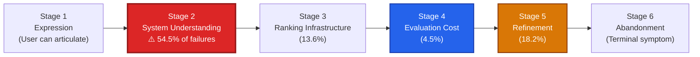
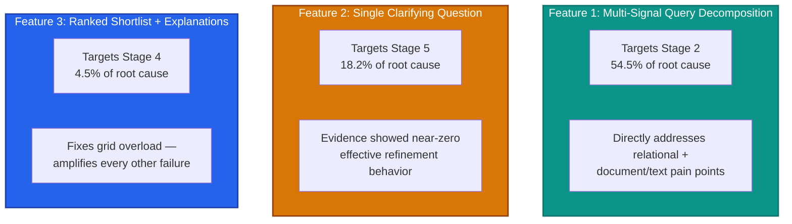
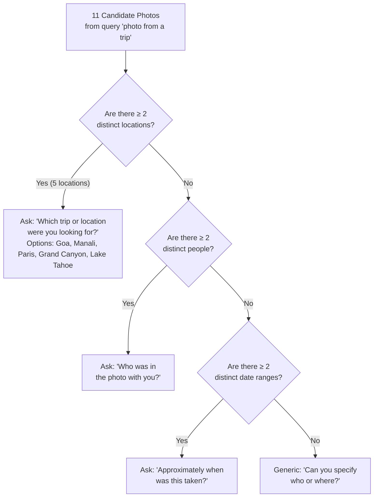
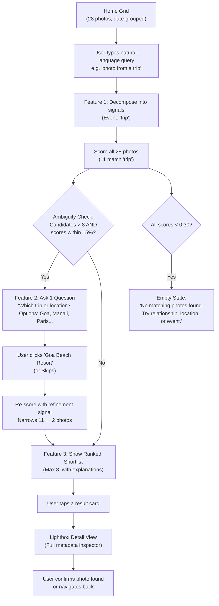

# ✨ MemoryLens — Product Management Deck
## AI-Native Vague-Memory Photo Retrieval Assistant (Part 5 MVP)

**Live Prototype**: [https://googlephotossearch.onrender.com](https://googlephotossearch.onrender.com)

---

## Slide 1 — Research Foundation & Root Cause

> [!IMPORTANT]
> **The Core Finding**: Root-cause analysis across **22 verified evidence records** and a **39-respondent survey** revealed that **54.5% of all photo retrieval failures originate at Stage 2 (System Understanding)** — not at memory recall, ranking infrastructure, or user abandonment.

### The 6-Stage Retrieval Failure Model



### Survey-Corrected Pain Points (What Actually Fails)

| Pain Point Category | Severity Rank | Example User Query | Why Traditional Search Fails |
|---|---|---|---|
| **Relational Language** | **#1 (Highest)** | *"the photo with my roommate"* | System has no concept of who "roommate" is — requires exact tagged name |
| **Document / Text Recall** | **#2** | *"the receipt for my laptop"* | User remembers *purpose* ("laptop receipt"), not exact OCR text ("MACBOOK PRO 14 M3 MAX") |
| **Temporal Memory** | #3 (Lower than expected) | *"last summer at the beach"* | Partially supported by existing date filters — not the primary gap |

> [!NOTE]
> This target reflects the **survey-corrected ranking**, not the original public-evidence ranking. It has not yet been confirmed by the planned 5–6 person interview study. The MVP is built so results update easily if interviews shift the picture.

---

## Slide 2 — Problem Statement & MVP Hypothesis

### The Problem
> **Users describe what they remember in natural, relational, and contextual language. Photo search systems require a literal keyword/tag match. This gap causes 54.5% of retrieval failures.**

### The Hypothesis This MVP Tests
> **Can a system that decomposes a vague, natural-language memory into structured signals — rather than requiring an exact keyword/tag match — meaningfully improve retrieval success for relational and document/text recall failure types?**

### What This MVP Is — and Isn't

| In Scope | Explicitly Out of Scope |
|---|---|
| A seeded demo dataset (28 photos with pre-populated metadata simulating relationships, OCR text, visual/place descriptors, dates) | Live integration with a real photo library or account |
| A natural-language search experience layered into a photo-app-styled UI shell | Production-grade relationship graphs, trained visual embeddings, or real OCR pipelines |
| 3 features working end-to-end against the seeded dataset | Fixing Stage 1 (expression) or Stage 3 (ranking infrastructure) |
| A publicly deployable, testable prototype that a stranger can use | Any claim that this represents how a production backend works |

---

## Slide 3 — Why Exactly These 3 Features

Each feature targets a specific failure stage with the strongest evidence base:



**Deliberately excluded**: Stage 1 (expression — not evidenced as broken), Stage 3 (ranking infrastructure — out of scope for a research prototype), and anything that only acts after Stage 6 (abandonment is a *symptom*, not the cause).

---

## Slide 4 — Feature 1: Multi-Signal Query Decomposition (Full Detail)

### What It Does
Takes a single natural-language query and **decomposes** it into separate structured signals, then matches each signal against the corresponding metadata field(s) in the dataset, combining results into a relevance-ranked set.

### The 5 Signal Categories

| Signal Category | Example Triggers in Query | Matched Against in Dataset | Matching Logic |
|---|---|---|---|
| **Relational Terms** | `"my roommate"`, `"my sister"`, `"college friend"`, `"cousin"` | `relationships[]`, `tagged_names[]` | Maps relational role labels → tagged individuals via the People Graph. E.g., `"roommate"` resolves to `Ananya` because her face cluster carries the relationship tag `"roommate"`. |
| **Document Intent** | `"receipt for laptop"`, `"flight ticket"`, `"concert pass"`, `"boarding pass"` | `document_purpose`, `ocr_text` | Detects user intent to locate an invoice, ticket, or screenshot based on *purpose* (e.g., `"laptop purchase receipt"`) rather than exact OCR content (e.g., `"MACBOOK PRO 14 M3 MAX"`). |
| **Visual & Place** | `"birthday cake"`, `"blue chairs"`, `"café"`, `"beach"`, `"mountains"` | `place_name`, `visual_descriptors[]` | Performs semantic/fuzzy matching. E.g., `"café"` expands to match `"Blue Bottle Coffee"`, `"Starbucks"`, `"Artisan Café"`, and visual descriptors like `"outdoor seating"`, `"espresso"`, `"bistro table"`. |
| **Event Context** | `"birthday"`, `"graduation"`, `"game night"`, `"baking"`, `"camping"` | `event_tags[]` | Matches named events, activities, and social occasions. Supports partial substring matching (e.g., `"birthday"` matches `"birthday prep"` and `"family party"`). |
| **Temporal Terms** | `"Summer 2024"`, `"Fall 2023"`, `"last summer"`, `"2024"` | `approx_date_range`, `date_taken` | Filters by approximate date windows or seasonal ranges. Lower weight (0.20) reflecting research finding that temporal memory is a less severe pain point. |

### Decomposition Output Schema
When a user types a query, the engine produces this structured JSON:
```json
{
  "relational_terms": ["roommate"],
  "visual_place_terms": ["café", "blue chairs"],
  "document_intent": null,
  "event_terms": [],
  "temporal_terms": null,
  "is_precise_query": false
}
```

### Scoring Algorithm

**Step 1 — Active Category Normalization**
Scores are calculated *only* over categories present in the user's query, not across all 5 categories. This prevents empty categories from diluting scores:

$$\text{base\_score} = \frac{\sum_{c \in C_{\text{active}}} w_c \cdot s_c}{\sum_{c \in C_{\text{active}}} w_c}$$

Category weights: **Relational (0.35)**, **Document Intent (0.35)**, **Visual/Place (0.30)**, **Event (0.25)**, **Temporal (0.20)**.

**Step 2 — Multi-Signal Synergy Boost**
A **1.25× multiplier** is applied when a photo matches multiple independent signal categories simultaneously (e.g., both Relational AND Visual/Place, or Event AND Visual). This ensures the correct target photo outranks single-keyword coincidence matches.

**Step 3 — Confidence Banding**
- Score ≥ 0.70 → **High Match** (Teal/Green badge)
- 0.30 ≤ Score < 0.70 → **Medium Match** (Amber/Blue badge)
- Score < 0.30 → **Filtered out** (not shown to user)

### Edge Cases Handled

| Edge Case | Behavior |
|---|---|
| **Zero Signal Matches** (Score < 0.30 for all photos) | Bypasses clarification entirely. Displays structured empty state: *"No matching photos found. Try searching by relationship, location, or event."* |
| **Relationship term on wrong photo context** (e.g., `"roommate"` in an OCR book title, but no relationship tag) | Conjunctive synergy multiplier ensures photos matching *both* relationship + place outrank photos matching only one signal. Adversarial distractor `photo_020` (book titled "My Roommate is a Detective") correctly filtered. |
| **Precise query** (exact name/date typed) | Decomposition sets `is_precise_query: true` and routes to exact field matching instead of fuzzy signal scoring. |
| **Dynamic Vocabulary** | Engine auto-indexes every visual descriptor, event tag, place name, and relationship from the dataset at startup. No hardcoded keyword lists — any term in the dataset is discoverable. |

### Search Mode Toggle
A header toggle switch (`AI Decomposed` vs. `Literal Baseline`) lets evaluators explicitly demonstrate how keyword-only search fails on the same queries where AI decomposition succeeds.

---

## Slide 5 — Feature 2: Single Clarifying Question on Ambiguity (Full Detail)

### What It Does
When Feature 1 cannot narrow results to a small, confident shortlist, the system asks **exactly one** targeted follow-up question before showing results — never a multi-step clarification chain.

### Trigger Conditions
The system evaluates two conditions after initial scoring:

| Condition | Logic | Example |
|---|---|---|
| **Condition A** (Too many close matches) | Candidate set **> 8 photos** AND the 8th photo's score ≥ **85%** of the top photo's score | `"photo from a trip"` → 11 trip photos, all scoring within a narrow band |
| **Condition B** (Weak single-signal match) | Candidate set **≥ 4 photos** AND top photo score **< 0.55** | `"something at a park"` → multiple park photos, none strongly matching |

### How the Question Is Chosen
The system evaluates candidate metadata to find the dimension with **highest entropy** (most diversity) — i.e., the question that would eliminate the most ambiguity:



### UI Presentation
- **Inline card** rendered above the results area with the question text, selectable **option chips** (clickable buttons for each choice), and a visible **Skip** button.
- Clicking an option chip feeds the answer as a `refinement` parameter back into Feature 1's scoring engine.

### Strict 1-Turn Maximum Limit (Critical Constraint)
This is a **hardcoded safety constraint**, not a soft guideline:

| User Action | System Response | Loops Again? |
|---|---|---|
| User clicks a relevant option chip (e.g., "Goa Beach Resort") | Re-scores with additional signal, narrows shortlist from 11 → 2 photos | **Never** |
| User clicks **Skip** | Shows best-available top 8 shortlist immediately | **Never** |
| User's answer doesn't match any recognizable signal | Shows best-available top 8 shortlist with badge *"Showing closest available matches"* | **Never** |
| Refined query still has > 8 close candidates | Shows top 8 immediately — does **not** ask a second question | **Never** |

> [!WARNING]
> The 1-turn limit is a deliberate scope decision. Flag this as a known limitation if Part 6 user testing reveals users wanting multi-turn clarification dialogue.

---

## Slide 6 — Feature 3: Ranked Shortlist with "Why This Matched" Explanations (Full Detail)

### What It Does
Replaces infinite photo grids with a **curated, transparent shortlist** — directly addressing the grid-overload / evaluation-cost pain pattern found in research, where users abandoned search even when the correct photo was technically in the results.

### Display Specifications

| Component | Specification |
|---|---|
| **Maximum results cap** | **Strictly 8 items**, even if more technically match. Never exceeded under any query or refinement path. |
| **Rank overlay** | Each result card displays `#1`, `#2`, `#3`... rank badges visually indicating order. |
| **Confidence badge** | `High Match` (Teal/Green pill, Score ≥ 0.70) or `Medium Match` (Amber/Blue pill, 0.30 ≤ Score < 0.70). |
| **Match explanation** | A one-line, human-readable string generated deterministically from the matched signals. **Never a generic placeholder.** |
| **Result ordering** | Ranked by composite score — highest confidence shown first. |

### Explanation Generation Rules
Explanations are generated via **deterministic template strings** based on matched fields. This guarantees zero latency and avoids hallucinations:

| Match Type | Example Explanation |
|---|---|
| Multi-signal match | `"Matches relational 'roommate' + visual descriptor 'Blue Bottle Coffee'"` |
| Single-signal match | `"Matches event 'birthday prep'"` |
| Multi-signal with synergy | `"Matches visual descriptor 'birthday cake' + event 'birthday' + multi-signal synergy bonus"` |
| Document intent match | `"Matches document purpose 'laptop purchase receipt'"` |

### Empty State
When all photos score below 0.30 (no meaningful match):
> *"No matching photos found. Try searching by relationship ('roommate'), location ('café'), or event ('birthday')."*

---

## Slide 7 — Data Model & Seeded Dataset Composition

### Photo Record Schema
Each of the 28 photos in the dataset carries **10 metadata fields** enabling multi-signal retrieval:

```json
{
  "photo_id": "photo_001",
  "image_url": "data:image/svg+xml;utf8,...",
  "date_taken": "2024-07-15T14:30:00Z",
  "approx_date_range": "Summer 2024",
  "relationships": ["roommate"],
  "tagged_names": ["Ananya"],
  "place_name": "Blue Bottle Coffee",
  "visual_descriptors": ["outdoor seating", "blue chairs", "coffee cups", "smiling women"],
  "event_tags": ["coffee hangout", "weekend"],
  "ocr_text": null,
  "document_purpose": null
}
```

### Dataset Composition (Verified Against PRD §5 Minimums)

| Requirement | PRD Minimum | Actual Count | Status |
|---|---|---|---|
| Total records | 25–30 | **28** | ✅ |
| Relational cluster photos | ≥ 4 | **16** | ✅ |
| Document/receipt cluster photos | ≥ 4 | **8** | ✅ |
| Event cluster (single `event_tags` value) | ≥ 8 | **9** (`"trip"`) | ✅ |
| Mixed `place_name` presence | Both populated and null | **25 populated, 3 null** | ✅ |
| Adversarial near-miss distractors | ≥ 6 | **6** | ✅ |

### Adversarial Distractor Records (Purpose & Design)

| Distractor | Photo ID | What It Tests |
|---|---|---|
| Book titled *"My Roommate is a Detective"* | `photo_020` | `"roommate"` appears in `ocr_text` but has no relationship tag — tests that the engine doesn't false-match on OCR substring |
| Café photo with Ananya tagged as **cousin**, not roommate | `photo_021` | Same person name + café location, but wrong relationship — tests relational precision |
| Grocery receipt (Whole Foods) | `photo_022` | Has `document_purpose: "grocery receipt"` — tests that `"laptop receipt"` queries don't false-match any receipt |
| Photo of a physical laptop on desk (no receipt metadata) | `photo_023` | Has `"macbook"` in visual descriptors but no `document_purpose` — tests that visual-only matches don't outrank document-intent matches |
| Park picnic with roommate (no café) | `photo_025` | Has `relationships: ["roommate"]` but location is a park, not a café — tests that multi-signal synergy correctly prioritizes café + roommate over park + roommate |
| Corner Café with Rohan (college friend, not roommate) | `photo_026` | Café location present but relationship is `"college friend"` — tests relational specificity |

---

## Slide 8 — UI Specification & User Interaction Flow

### Three Screens

````carousel
### Screen 1: Home / Library Grid
- **Top search bar** with placeholder: *"Search for a photo — try describing who, where, or what happened..."*
- **Search Mode toggle**: `AI Decomposed` vs. `Literal Baseline`
- **Date-grouped photo grid** organized chronologically by month/year
- **Responsive layout**: 4 columns (desktop/tablet) → 2 columns (mobile)
- **Generic branding**: `✨ MemoryLens` — zero Google trademarks
<!-- slide -->
### Screen 2: Search Results
- Search bar retained at top with active mode indicator
- **Inline clarifying question card** (if Feature 2 triggers) with option chips + Skip button
- **Ranked shortlist** (max 8 items) with rank overlays, confidence badges, and match explanations
- **Empty state** when Score < 0.30 across all photos
- **Responsive**: Stacked vertical cards on mobile (thumbnail top/left, metadata right/below)
<!-- slide -->
### Screen 3: Photo Detail / Lightbox
- Opens on tapping any result card or grid photo
- **Full-screen modal** showing: image preview, date taken, approximate date range, tagged names & relationships, place name, visual descriptors, event tags, document purpose, and full OCR text
- **Mobile**: Full-screen modal with scrollable metadata bottom sheet
````

### End-to-End User Interaction Flow



---

## Slide 9 — Live Empirical Results & Benchmark Proof

> [!TIP]
> All results below were verified against the **live deployed prototype** at [https://googlephotossearch.onrender.com](https://googlephotossearch.onrender.com) — not local/test environments.

### Scenario A — Relational Recall

| Metric | AI Decomposed Search | Literal Keyword Baseline |
|---|---|---|
| **Query** | *"the photo with my roommate at the café"* | *"the photo with my roommate at the café"* |
| **Top result** | `photo_001` — Ananya at Blue Bottle Coffee | `photo_026` — Corner Café with Rohan (wrong person) |
| **Score** | **1.0 (High Match)** | 0.333 (Partial Keyword) |
| **Explanation** | *"Matches relational 'roommate' + visual descriptor 'Blue Bottle Coffee'"* | *"Literal keyword match on: 'cafe'"* |
| **Target found?** | ✅ **Rank #1** | ❌ **Not in top results** |

### Scenario B — Document / Text Recall

| Metric | AI Decomposed Search | Literal Keyword Baseline |
|---|---|---|
| **Query** | *"the receipt I screenshotted for my laptop"* | *"the receipt I screenshotted for my laptop"* |
| **Top result** | `photo_006` — Best Buy MacBook Pro receipt | `photo_026` — Corner Café (matches "laptop" in visual descriptors) |
| **Score** | **1.0 (High Match)** | 0.333 (Partial Keyword) |
| **Explanation** | *"Matches document purpose 'laptop purchase receipt' + visual descriptor 'paper receipt'"* | *"Literal keyword match on: 'laptop'"* |
| **Target found?** | ✅ **Rank #1** | ❌ **Not in top results** |

### Scenario C — Grid Overload & Ambiguity Resolution

| Step | Result |
|---|---|
| Initial query `"photo from a trip"` | 11 candidates match → **Ambiguity triggered** |
| Clarifying question asked | *"Which trip or location were you looking for?"* with 5 location chips |
| User selects "Goa Beach Resort" | Shortlist narrows to **2 target photos** (`photo_011`, `photo_012`) |
| User clicks Skip instead | Top 8 rendered immediately — **no blocking, no second question** |
| Unmapped/unhelpful answer | Best-available shortlist shown — **strict 1-turn limit enforced** |

---

## Slide 10 — Acceptance Verification Summary

| Test Suite | Test Case | Expected Outcome | Live Result |
|---|---|---|---|
| **Dataset Validation** | Schema & composition check | 28 records, ≥ 4 relational, ≥ 4 documents, ≥ 8 event cluster, 6 distractors | ✅ **PASSED** |
| **Feature 1 (Decomposition)** | Scenario A query | `photo_001` in top 3; literal baseline fails | ✅ **PASSED** |
| **Feature 1 (Decomposition)** | Scenario B query | `photo_006` in top 3; literal baseline fails | ✅ **PASSED** |
| **Feature 1 (Edge Case)** | Zero-match query `"random xyz 9999"` | `zero_match: true`, structured empty state shown | ✅ **PASSED** |
| **Feature 1 (Edge Case)** | Conjunctive over-matching protection | Café + roommate photo outranks park + roommate photo | ✅ **PASSED** |
| **Feature 1 (Edge Case)** | Precise query routing `"photo of Ananya"` | `is_precise_query: true` | ✅ **PASSED** |
| **Feature 2 (Clarification)** | Ambiguous query triggers exactly 1 question | `is_ambiguous: true`, 1 question rendered | ✅ **PASSED** |
| **Feature 2 (Refinement)** | Answering question narrows results | 11 candidates → 2 Goa photos | ✅ **PASSED** |
| **Feature 2 (Skip)** | Dismissing question returns usable results | Top 8 shortlist returned, no blocking | ✅ **PASSED** |
| **Feature 2 (1-Turn Limit)** | Unmapped answer does not loop | `is_ambiguous: false`, no second question | ✅ **PASSED** |
| **Feature 3 (Shortlist Cap)** | Query matching 11+ photos | Rendered count capped at **8** | ✅ **PASSED** |
| **Feature 3 (Explanations)** | All results have specific explanation | Zero generic placeholders across all queries | ✅ **PASSED** |
| **Branding** | No Google trademark in deployed UI | Generic `✨ MemoryLens` name and icon only | ✅ **PASSED** |
| **Deployment** | Public link loads without setup | [https://googlephotossearch.onrender.com](https://googlephotossearch.onrender.com) accessible | ✅ **PASSED** |
| **E2E Chained Flow** | All 3 scenarios Home → Search → [Clarify] → Shortlist → Detail | 100% integration pass | ✅ **PASSED** |

---

## Slide 11 — Open Questions & Risks to Flag

> [!WARNING]
> These items should be called out transparently in the presentation.

1. **Target segment not yet interview-validated**: The relational + document/text prioritization is survey-corrected but has not been confirmed by the planned 5–6 person interview study. Treat as best current evidence, not settled fact.
2. **1-turn clarification limit is a scope decision, not a product conviction**: If Part 6 testing reveals users wanting multi-turn clarification, this constraint should be revisited.
3. **Seeded dataset, not real library**: All matching quality is demonstrated against 28 curated records with pre-populated metadata. Scaling to real libraries would require production-grade face recognition, relationship graphs, OCR pipelines, and visual embedding search — none of which are built in this prototype.
4. **Fuzzy matching quality depends on vocabulary coverage**: The dynamic vocabulary extraction covers all terms in the dataset, but real-world queries may use synonyms or phrasings not present in any metadata field.
